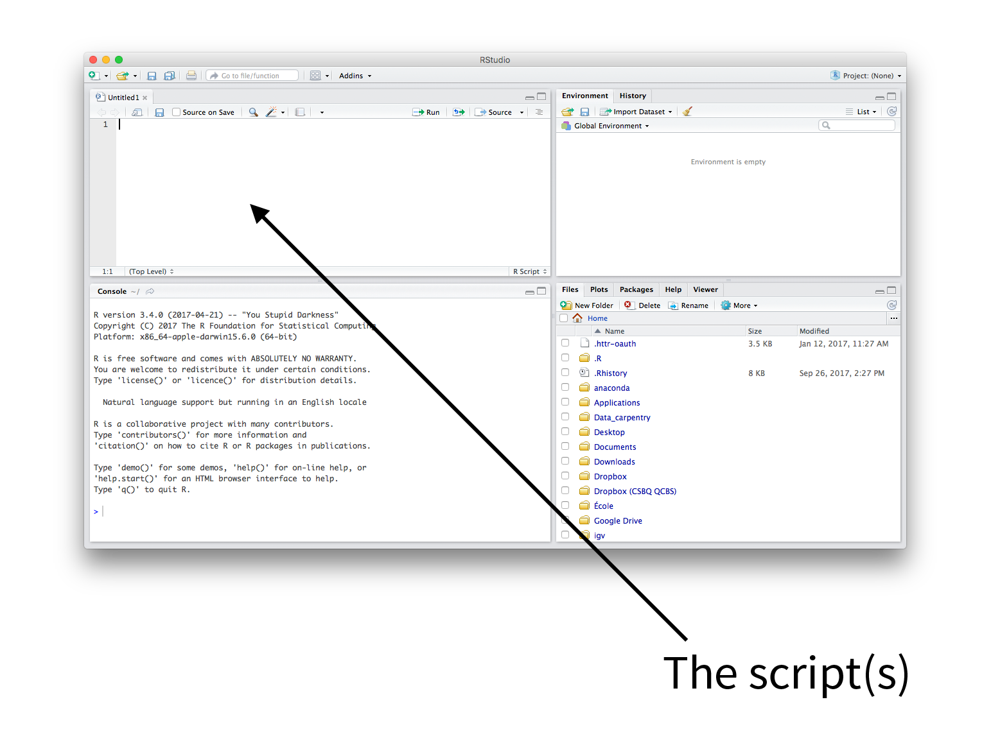
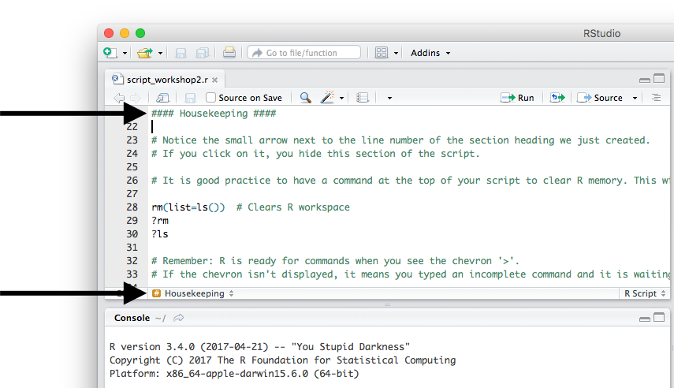

# Writing a script

An R script is a text file that contains all of the commands you will
use. Once written and saved, your R script will allow you to make
changes and re-run analyses with little effort.

To use a script, just highlight commands and press "Run" or press
command-enter (Mac) or ctrl-enter (PC).

### Creating an R script

{width="500"}
{width="600"}

### Commands & Comments

Use the '# symbol' to denote comments in scripts. The '# symbol'
tells R to ignore anything remaining on a given line of the script when
running commands.

Since comments are ignored when running script, they allow you to leave
yourself notes in your code or tell collaborators what you did. A script
with comments is a good step towards reproducible science, and
annotating someone's script is a good way to learn. Try to be as
detailed as possible!

```{r, echo = TRUE, eval = FALSE}
# This is a comment, not a command
```

### Header

It is recommended that you use comments to put a header at the beginning
of your script with essential information: project name, author, date,
version of R

```{r, echo = TRUE, eval = FALSE}
## QCBS R Workshop ##
## Workshop 2 - Loading and manipulating data
## Author: Quebec Center for Biodiversity Science
## Date: Fall 2014
## R version 2.15.0
```

### Section Heading

You can use four \# signs in a row to create section headings to help
organize your script. This allows you to move quickly between sections
and hide sections. For example:

```{r, echo = TRUE, eval = FALSE}
#### Housekeeping ####
```

RStudio displays a small arrow next to the line number where the section
heading was created. If you click on the arrow, you will hide this
section of the script.

You can also move quickly between sections using the drop-down menu at
the bottom of the script window.

{width="600"}

### Housekeeping

The first command at the top of all scripts should be `rm(list=ls())`.
This will clear R's memory, and will help prevent errors such as using
old data that has been left in your workspace.

```{r, echo = TRUE, eval = FALSE}
rm(list=ls())  # Clears R workspace
?rm
?ls
```

We can test this command by adding data to the workspace and seeing how
`rm(list=ls())` will remove it.

```{r, echo = TRUE, eval = FALSE}
A<-"Test" # Put some data in workspace
A <- "Test" # Add some spaces to organize your data!
A = "Test" # You can do this, but it does not mean you should
# Check objects in the workspace
ls()
# [1] "A"
A
# [1] "Test"
# Clean Workspace
rm(list=ls())
A
```

### Important Reminders

1.  R is ready for commands when you see the chevron '\>' displayed in
    the terminal. If the chevron isn't displayed, it means you typed an
    incomplete command and R is waiting for more input. Press ESC to
    exit and get R ready for a new command.
2.  R is case sensitive. i.e. "A" is a different object than "a"

```{r, echo = TRUE, eval = FALSE}
a<-10
A<-5
a
A

rm(list=ls())  # Clears R workspace again
```