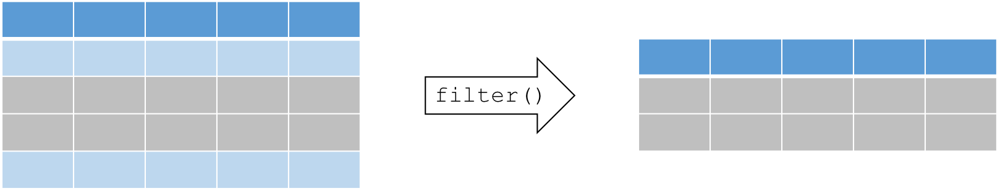

# Manipulate data with the tidyverse

### Using tidyr to reshape data frames

{width="200"}

### Why "tidy" your data?

Tidying allows you to manipulate the structure of your data while
preserving all original information. Many functions in R require (or
work better) with a data structure that isn't always easily readable by
people.

In contrast to aggregation, which reduces many cells in the original
data set to one cell in the new dataset, tidying preserves a one-to-one
connection. Although aggregation can be done with many functions in R,
the `tidyr` package allows you to both reshape and aggregate within a
single syntax.

Install / Load the `tidyr()` package:

```{r, echo = TRUE, eval = FALSE}
if(!require(tidyr)){install.packages("tidyr")}
library(tidyr)
```

### Wide vs. long data

**Wide** format data has a separate column for each variable or each
factor in your study. One row therefore can therefore include several
different observations.

**Long** format data has a column stating the measured variable types
and a column containing the values associated to those variables (each
column is a variable, each row is one observation). This is considered
"tidy" data because it is easily interpreted by most packages for
visualization and analysis in `R`.

The format of your data depends on your specific needs, but some
functions and packages such as `dplyr`, `lm()`, `glm()`, `gam()` require
long format data. The `ggplot2` package can use wide data format for
some basic plotting, but more complex plots require the long format
(example to come).

Additionally, long form data can more easily be aggregated and converted
back into wide form data to provide summaries, or to check the balance
of sampling designs.

We can use the `tidyr` package to to manipulate the structure of your
data while preserving all original information, using the following
functions:

-   1. `pivot_longer()` our data (wide \--\> long)
-   2. `pivot_wider()` our data (long \--\> wide)

{width="600"}

Let's pretend you send out your field assistant to measure the diameter
at breast height (DBH) and height of three tree species for you. The
result is this "wide" data set.

```{r, echo = TRUE, eval = FALSE}
> wide <- data.frame(Species = c("Oak", "Elm", "Ash"),
                          DBH = c(12, 20, 13),
                       Height = c(56, 85, 55))
> wide
  Species DBH Height
1     Oak  12     56
2     Elm  20     85
3     Ash  13     55
```

### pivot_longer(): Making your data long

```{r, echo = TRUE, eval = FALSE}
?pivot_longer
```

Most of the packages in the Hadleyverse will require long format data
where each row is an entry and each column is a variable. Let's try to
"gather" the this wide data using the `pivot_longer()` function in tidyr.
`pivot_longer()` takes multiple columns, and gathers them into key-value
pairs.

The function requires at least 3 arguments:

-   **data**: a data frame (e.g. "wide")
-   **cols**: name or numeric index of the columns we wish to gather
-   **names_to**: name of the new column containing variable names (e.g.
    "Measurement")
-   **values_to**: name of the new column containing variable values (e.g.
    "Value")
    (e.g. "DBH" or "Height")

```{r, echo = TRUE, eval = FALSE}
# Gathering columns into rows

> long <- pivot_longer(data      = wide, 
                       cols      = c("DBH", "Height"),
                       names_to  = "dimension", 
                       values_to = "cm")

> long
  Species dimension    cm
  <chr>   <chr>     <dbl>
1 Chene   DHP          12
2 Chene   Haut         56
3 Orme    DHP          20
4 Orme    Haut         85
5 Frene   DHP          13
6 Frene   Haut         55
```

Let's try this with the C02 dataset. Here we might want to collapse the
last two quantitative variables:

```{r, echo = TRUE, eval = FALSE}
CO2.long <- pivot_longer(CO2, cols = c("conc", "uptake"), 
                                       "response", "value")
head(CO2)
head(CO2.long)
tail(CO2.long)
```

### pivot_wider(): Making your data wide

`pivot_wider()` uses the same syntax as `pivot_longer()`. The function requires 3 arguments:

-   **data**: A data frame (e.g. "long")
-   **names_from**: Name of the column containing variable names (e.g.
    "Measurement")
-   **values_from**: Name of the column containing variable values (e.g.
    "Value")

```{r, echo = TRUE, eval = FALSE}
# Spreading rows into columns
> wide2 <- ivot_wider(data        = long, 
                      names_from  = "dimension", 
                      values_from = "cm")
> wide2
  Species   DBH Height
  <chr>   <dbl>  <dbl>
1 Oak        12     56
2 Elm        20     85
3 Ash        13     55
```

###  A `tibble` structure for your data

`Tibble` is an alternate, more convenient, version for a data frame. Using tibble ensures good coding practices that can be missed using `data.frame`. For instance, it does not change the type of inputs (e.g. string to factors). 

```{r, eval = FALSE}
tibble(x = 1:3, y = c("a","b","c"))
```

In addition, `tibble` simplifies the use of nested lists.

```{r, eval = FALSE}
tibble(x = 1:3, y = list(1:5, 1:10, 1:20))

```

You can use with a tibble all the functions applied to a data.frame.

---


### separate(): Separate two (or more) variables in a single column

{width="600"}

Some times you might have really messy data that has two variables in
one column. Thankfully the `separate()` function can (wait for it)
separate the two variables into two columns.

The `separate()` function splits a columns by a character string
separator. It requires 4 arguments:

-   **data**: A data frame (e.g. "long")
-   **col**: Name of the column you wish to separate
-   **into**: Names of new variables to create
-   **sep**: Character which indicates where to separate

Let's create a really messy data set:

```{r, echo = TRUE, eval = FALSE}
set.seed(8)
messy <- data.frame(id = 1:4,
                          trt = sample(rep(c('control', 'farm'), each = 2)),
               zooplankton.T1 = runif(4),
                      fish.T1 = runif(4),
               zooplankton.T2 = runif(4),
                      fish.T2 = runif(4))
messy
```

First, we want to convert this wide dataset to long format.

```{r, echo = TRUE, eval = FALSE}
messy.long <- pivot_longer(messy,
                           names_to = "taxa",
                           cols     = c("zooplankton.T1", 
                                        "fish.T1",
                                        "zooplankton.T2",
                                        "fish.T2"))
head(messy.long)
     id trt   taxa           value
  <int> <chr> <chr>          <dbl>
1     1 farm  zooplankton.T1 0.719
2     1 farm  fish.T1        0.644
3     1 farm  zooplankton.T2 0.545
4     1 farm  fish.T2        0.264
5     2 farm  zooplankton.T1 0.291
6     2 farm  fish.T1        0.457
```

Then, we want to split those two sampling times (T1 & T2). The syntax we
use here is to tell R `separate(data, what column, into what, by what)`.
The tricky part here is telling R where to separate the character string
in your column entry using a regular expression to describe the
character that separates them. Here, the string should be separated by
the period `"."`.

```{r, echo = TRUE, eval = FALSE}
messy.long.sep <- separate(messy.long, taxa, into = c("species", "time"), sep = "\\.")

head(messy.long.sep)

     id trt   species     time  value
  <int> <chr> <chr>       <chr> <dbl>
1     1 farm  zooplankton T1    0.719
2     1 farm  fish        T1    0.644
3     1 farm  zooplankton T2    0.545
4     1 farm  fish        T2    0.264
5     2 farm  zooplankton T1    0.291
6     2 farm  fish        T1    0.457
```

The argument `sep = "\."` tells R to splits the character string around
the period (.). We cannot type directly `"."` because it is a regular
expression that matches any single character.

### Recap: tidyr

`tidyr` is a package that reshapes the layout of data sets.

-   Convert from **wide format to long format** using `gather()`
-   Convert from **long format to wide format** using `spread()`
-   Split and merge columns with `unite()` and `separate()`

Here's cheat sheet to help you use `tidyr` and `dplyr` for more data
wrangling:
<https://www.rstudio.com/wp-content/uploads/2015/02/data-wrangling-cheatsheet.pdf>

### tidyr CHALLENGE

*Using the `airquality` dataset, `gather()` all the columns (except
Month and Day) into rows. Then `spread()` the resulting dataset to
return the same data format as the original data.*

```{r, echo = TRUE, eval = FALSE}
?air.quality
data(airquality)
```

### Solution

```{r, echo = TRUE, eval = FALSE}
# Use gather() to convert the dataset to long format
air.long <- gather(airquality, variable, value, -Month, -Day)
head(air.long)
# Note that the syntax used here indicates we wish to gather ALL the columns except "Month" and "Day"

# Then, use spread() to convert the dataset back to wide format
air.wide <- spread(air.long , variable, value)
head(air.wide)
```

### tidyr CHALLENGE 2

Spread the resulting data frame to return to the original data format.

### Solution

```{r, echo = TRUE, eval = FALSE}
air.wide <- pivot_wider(air.long,
                        values_from = "value",
                        names_from  = "variable")
head(air.wide)
```

------------------------------------------------------------------------

## Data manipulation with dplyr

{width="200"}

### Intro to dplyr

The vision of the `dplyr` package is to simplify data manipulation by
distilling all the common data manipulation tasks to a set of intuitive
functions (or "verbs"). The result is a comprehensive set of tools
that facilitates data manipulation, such as filtering rows, selecting
specific columns, re-ordering rows, adding new columns and summarizing
data.

In addition to ease of use, it is also an amazing package because:

-   it can crunch huge datasets wicked fast (written in `Cpp`)
-   it plays nice with the RStudio IDE and other packages in the
    Hadleyverse
-   it can interface with external databases and translate your R code
    into SQL queries
-   if Batman was an R package, he would be `dplyr` (mastering fear of
    data, adopting cool technologies)

Certain R base functions work similarly to dplyr functions, including:
`split()`, `subset()`, `apply()`, `sapply()`, `lapply()`, `tapply()` and
`aggregate()`

Let's install and load the `dplyr` package:

```{r, echo = TRUE, eval = FALSE}
if(!require(dplyr)){install.packages("dplyr")}
library(dplyr)
```

The `dplyr` package is built around a core set of "verbs" (or
functions). We will start with the following 4 verbs because these
operations are ubiquitous in data manipulation:

-   `select()`: select columns from a data frame
-   `filter()`: filter rows according to defined criteria
-   `arrange()`: re-order data based on criteria (e.g. ascending,
    descending)
-   `mutate()`: create or transform values in a column

### Select a subset of columns with `select()`

{width="600"}

The general syntax for this function is
`select(dataframe, column1, column2, ...)`. Most `dplyr` functions will
follow a similarly simple syntax. `select()` requires at least 2
arguments:

-   **data**: the dataset to manipulate
-   **...**: column names, positions, or complex expressions (separated
    by commas)

For example:

```{r, echo = TRUE, eval = FALSE}
select(data, column1, column2) # select columns 1 and 2
select(data, c(2:4,6) # select columns 2 to 4 and 6
select(data, -column1) # select all columns except column 1
select(data, start_with(x.)) # select all columns that start with "x."
```

Here are more examples of how to use `select()`:

{width="400"}

The `airquality` dataset contains several columns:

```{r, echo = TRUE, eval = FALSE}
> head(airquality)
  Ozone Solar.R Wind Temp Month Day
1    41     190  7.4   67     5   1
2    36     118  8.0   72     5   2
3    12     149 12.6   74     5   3
4    18     313 11.5   62     5   4
5    NA      NA 14.3   56     5   5
6    28      NA 14.9   66     5   6
```

For example, suppose we are only interested in the variation of
"Ozone" over time within the `airquality` dataset, then we can select
the subset of required columns for further analysis:

```{r, echo = TRUE, eval = FALSE}
> ozone <- select(airquality, Ozone, Month, Day)
> head(ozone)
  Ozone Month Day
1    41     5   1
2    36     5   2
3    12     5   3
4    18     5   4
5    NA     5   5
6    28     5   6
```

### Select a subset of rows with `filter()`

A common operation in data manipulation is the extraction of a subset
based on specific conditions. The general syntax for this function is
`filter(dataframe, logical statement 1, logical statement 2, ...)`.

{width="600"}

Remember that logical statements provide a TRUE or FALSE answer. The
`filter()` function retains all the data for which the statement is
TRUE. This can also be applied on characters and factors. Here is a
useful reminder of how logic works in R.
{width="500"}

For example, in the `airquality` dataset, suppose we are interested in
analyses that focus on the month of August during high temperature
events:

```{r, echo = TRUE, eval = FALSE}
> august <- filter(airquality, Month == 8, Temp >= 90)
> head(august)
  Ozone Solar.R Wind Temp Month Day
1    89     229 10.3   90     8   8
2   110     207  8.0   90     8   9
3    NA     222  8.6   92     8  10
4    76     203  9.7   97     8  28
5   118     225  2.3   94     8  29
6    84     237  6.3   96     8  30
```

### Sorting rows with `arrange()`

In data manipulation, we sometimes need to sort our data (e.g.
numerically or alphabetically) for subsequent operations. A common
example of this is a time series.

The `arrange()` function re-orders rows by one or multiple columns,
using the following syntax: `arrange(data, variable1, variable2, ...)`.

By default, rows are sorted in ascending order. Note that we can also
sort in descending order by placing the target column in `desc()` inside
the `arrange()` function as follows:
`arrange(data, variable1, desc(variable2), ...)`.

Example: Let's use the following code to create a scrambled version of
the airquality dataset

```{r, echo = TRUE, eval = FALSE}
> air_mess <- sample_frac(airquality, 1)
> head(air_mess)
    Ozone Solar.R Wind Temp Month Day
21      1       8  9.7   59     5  21
42     NA     259 10.9   93     6  11
151    14     191 14.3   75     9  28
108    22      71 10.3   77     8  16
8      19      99 13.8   59     5   8
104    44     192 11.5   86     8  12
```

Now, let's arrange the data frame back into chronological order,
sorting by `Month`, and then by `Day`:

```{r, echo = TRUE, eval = FALSE}
> air_chron <- arrange(air_mess, Month, Day)
> head(air_chron)
  Ozone Solar.R Wind Temp Month Day
1    41     190  7.4   67     5   1
2    36     118  8.0   72     5   2
3    12     149 12.6   74     5   3
4    18     313 11.5   62     5   4
5    NA      NA 14.3   56     5   5
6    28      NA 14.9   66     5   6
```

Try to see the difference when we change the order of the target
columns:

```{r, echo = TRUE, eval = FALSE}
arrange(air_mess, Day, Month)
```

### Create and populate columns with `mutate()`

Besides subsetting or sorting your data frame, you will often require
tools to transform your existing data or generate some additional data
based on existing variables. We can use the function `mutate()` to
compute and add new columns in your dataset.

The `mutate()` function follows this syntax:
`mutate(data, newVar1 = expression1, newVar2 = expression2, ...)`.

{width="600"}

Let's create a new column using `mutate()`. For example, suppose we
would like to convert the temperature variable from degrees Fahrenheit
to degrees Celsius:

```{r, echo = TRUE, eval = FALSE}
> airquality_C <- mutate(airquality, Temp_C = (Temp-32)*(5/9))
> head(airquality_C)
  Ozone Solar.R Wind Temp Month Day   Temp_C
1    41     190  7.4   67     5   1 19.44444
2    36     118  8.0   72     5   2 22.22222
3    12     149 12.6   74     5   3 23.33333
4    18     313 11.5   62     5   4 16.66667
5    NA      NA 14.3   56     5   5 13.33333
6    28      NA 14.9   66     5   6 18.88889
```

Note that the syntax here is quite simple, but within a single call of
the `mutate()` function, we can replace existing columns, we can create
multiple new columns, and each new column can be created using newly
created columns within the same function call.

------------------------------------------------------------------------

## dplyr and magrittr, a match made in heaven

{width="200"}

The `magrittr` package brings a new and exciting tool to the table: a
pipe operator. Pipe operators provide ways of linking functions together
so that the output of a function flows into the input of next function
in the chain. The syntax for the `magrittr` pipe operator is `%>%`. The
`magrittr` pipe operator truly unleashes the full power and potential of
`dplyr`, and we will be using it for the remainder of the workshop.
First, let's install and load it:

```{r, echo = TRUE, eval = FALSE}
if(!require(magrittr)){install.packages("magrittr")}
require(magrittr)
```

Using it is quite simple, and we will demonstrate that by combining some
of the examples used above. Suppose we wanted to `filter()` rows to
limit our analysis to the month of June, then convert the temperature
variable to degrees Celsius. We can tackle this problem step by step, as
before:

```{r, echo = TRUE, eval = FALSE}
june_C <- mutate(filter(airquality, Month == 6), Temp_C = (Temp-32)*(5/9))
```

This code can be difficult to decipher because we start on the inside
and work our way out. As we add more operations, the resulting code
becomes increasingly illegible. Instead of wrapping each function one
inside the other, we can accomplish these 2 operations by linking both
functions together:

```{r, echo = TRUE, eval = FALSE}
june_C <- airquality %>%
    filter(Month == 6) %>%
    mutate(Temp_C = (Temp-32)*(5/9))
```

Notice that within each function, we have removed the first argument
which specifies the dataset. Instead, we specify our dataset first, then
"pipe" into the next function in the chain.

The advantages of this approach are that our code is less redundant and
functions are executed in the same order we read and write them, which
makes its easier and quicker to both translate our thoughts into code
and read someone else's code and grasp what is being accomplished. As
the complexity of your data manipulations increases, it becomes quickly
apparent why this is a powerful and elegant approach to writing your
`dplyr` code.

**Quick tip:** In RStudio we can insert this pipe quickly using the
following hotkey: `Ctrl` (or `Cmd` for Mac) +`Shift`+`M`.

## dplyr - grouped operations and summaries

The `dplyr` verbs we have explored so far can be useful on their own,
but they become especially powerful when we link them with each other
using the pipe operator (`%>%`) and by applying them to groups of
observations. The following functions allow us to split our data frame
into distinct groups on which we can then perform operations
individually, such as aggregating/summarising:

-   `group_by()`: group data frame by a factor for downstream commands
    (usually summarise)
-   `summarise()`: summarise values in a data frame or in groups within
    the data frame with aggregation functions (e.g. `min()`, `max()`,
    `mean()`, etc...)

These verbs provide the needed backbone for the Split-Apply-Combine
strategy that was initially implemented in the `plyr` package on which
`dplyr` is built.

{width="600"}
{width="600"}

Let's demonstrate the use of these with an example using the
`airquality` dataset. Suppose we are interested in the mean temperature
and standard deviation within each month:

```{r, echo = TRUE, eval = FALSE}
> month_sum <- airquality %>%
      group_by(Month) %>%
      summarise(mean_temp = mean(Temp),
                sd_temp = sd(Temp))
> month_sum
Source: local data frame [5 x 3]

  Month mean_temp  sd_temp
  (int)     (dbl)    (dbl)
1     5  65.54839 6.854870
2     6  79.10000 6.598589
3     7  83.90323 4.315513
4     8  83.96774 6.585256
5     9  76.90000 8.355671
```

### dplyr & magrittr CHALLENGE

*Using the `ChickWeight` dataset, create a summary table which displays
the difference in weight between the maximum and minimum weight of each
chick in the study. Employ `dplyr` verbs and the `%>%` operator.*

```{r, echo = TRUE, eval = FALSE}
?ChickWeight
data(ChickWeight)
```

### Solution

```{r, echo = TRUE, eval = FALSE}
# Use group_by() to divide the dataset by "Chick"
# Use summarise() to calculate the weight gain within each group
> weight_diff <- ChickWeight %>%
      group_by(Chick) %>%
      summarise(weight_diff = max(weight) - min(weight))
> weight_diff
Source: local data frame [50 x 2]

    Chick weight_diff
   (fctr)       (dbl)
1      18           4
2      16          16
3      15          27
4      13          55
5       9          58
6      20          76
7      10          83
8       8          92
9      17         100
10     19         114
..    ...         ...
```

Note that we are only calculating the difference between max and min
weight. This doesn't necessarily correspond to the difference in mass
between the beginning and the end of the trials. Closely inspect the
data for chick \# 18 to understand why this is the case:

```{r, echo = TRUE, eval = FALSE}
> chick_18 <- ChickWeight %>% filter(Chick == 18)
> chick_18
  weight Time Chick Diet
1     39    0    18    1
2     35    2    18    1
```

Here we notice that chick 18 has in fact lost weight (and probably died
during the trial). From a scientific perspective, perhaps a more
interesting question is which of the 4 diets results in the greatest
weight gain in chicks. We could calculate this using 2 more useful
`dplyr` functions: `first()` and `last()` allow us to access the (need I
say respectively) first and last observation within a group. ++++

------------------------------------------------------------------------

### dplyr & magrittr NINJA CHALLENGE

*Using the `ChickWeight` dataset, create a summary table which displays,
for each diet, the average individual difference in weight between the
end and the beginning of the study. Employ `dplyr` verbs and the `%>%`
operator. (Hint: `first()` and `last()` may be useful here.)*

### Ninja hint

Note that we can group the data frame using more than one factor, using
the general syntax as follows: `group_by(group1, group2, ...)`

Within `group_by()`, the multiple groups create a layered onion, and
each subsequent single use of the `summarise()` function peels off the
outer layer of the onion. In the above example, after we carried out a
summary operation on `group2`, the resulting data set would remain
grouped by `group1` for downstream operations.

### Solution

```{r, echo = TRUE, eval = FALSE}
> diet_summ <- ChickWeight %>%
      group_by(Diet, Chick) %>%
      summarise(weight_gain = last(weight) - first(weight)) %>%
      group_by(Diet) %>%
      summarise(mean_gain = mean(weight_gain))
> diet_summ
# A tibble: 4 × 2
    Diet mean_gain
  <fctr>     <dbl>
1      1     114.9
2      2     174.0
3      3     229.5
4      4     188.3
```

Given that the solution to the last challenge requires that we compute
several operations in sequence, it provides a nice example to
demonstrate why the syntax implemented by `dplyr` and `magrittr`. An
additional challenge (if you are well versed in base `R` functions)
would to reproduce the same operations using fewer key strokes. We
tried, and failed... Perhaps we are too accustomed to `dplyr` now. ++++

------------------------------------------------------------------------

## dplyr - Merging data frames

In addition to all the operations we have explored, `dplyr` also
provides some functions that allow you to join two data frames together.
The syntax in these functions is simple relative to alternatives in
other `R` packages:

-   `left_join()`
-   `right_join()`
-   `inner_join()`
-   `anti_join()`

These are beyond the scope of the current introductory workshop, but
they provide extremely useful functionality you may eventually require
for some more advanced data manipulation needs.