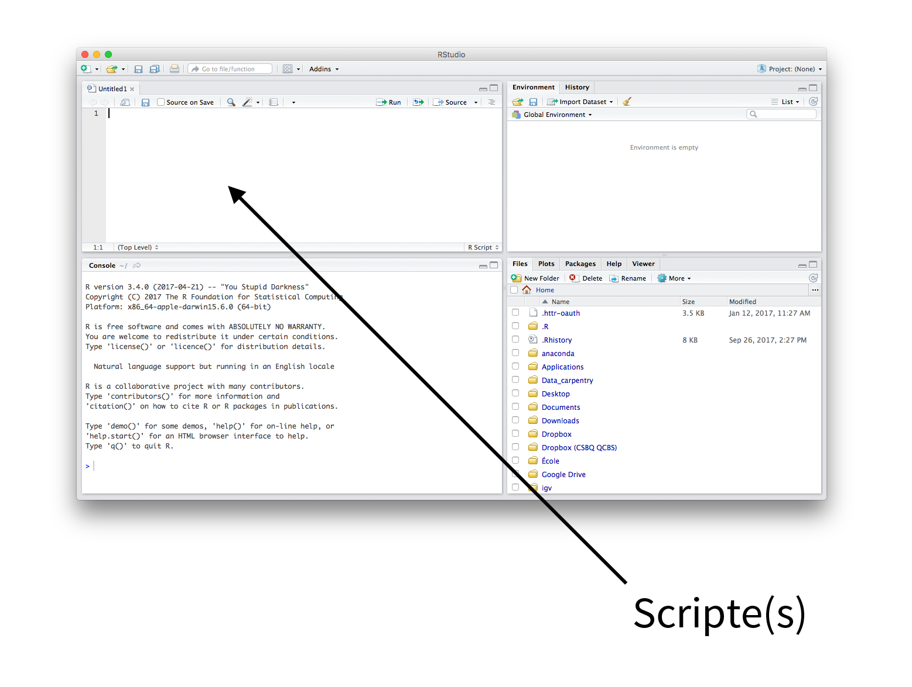

# Écrire un script dans R

Un script R est un fichier texte contenant toutes les commandes
nécessaires pour réaliser un projet. Une fois écrit et enregistré, votre
script R vous permettra d'apporter des changements et de refaire des
analyses avec un minimum d'effort.

Afin d'utiliser un script dans RStudio, il suffi simplement de
surligner une commande et appuyer sur "Run" ou appuyer sur
"command-enter" (Mac) ou "ctrl-enter" (PC).

{width="500"}
{width="600"}

### Commandes & Commentaires

Utilisez le symbole '\#' pour insérer des commentaires au sein d'un
script. Ceci indique à R d'ignorer tout ce qui se trouve à la suite du
symbole '\#' lors de l'exécution de commandes.

Puisque les commentaires sont ignorés par R lors de l'exécution de
scripts, il est possible de se laisser des notes ou d'indiquer à des
collaborateurs ce qui a été fait. Un script enrichi de commentaires est
une bonne façon de collaborer à une science reproductible et permet de
comprendre comment R fonctionne.

```{r, echo = TRUE, eval = FALSE}
# Ceci est un commentaire, pas une commande !
```

### En-têtes

Il est recommandé d'ajouter des commentaires au début de chaque script
sous forme d'en-tête en indiquant quelques informations essentielles :
nom du projet, auteur, date et version de R.

```{r, echo = TRUE, eval = FALSE}
## Atelier R du CSBQ ##
## Atelier 2 - Charger et manipuler des données
## Auteur: Centre de la science de la biodiversité du Québec
## Date: Automne 2014
## R version 2.15.0
```

### En-têtes de section

Vous pouvez utiliser quatre symboles '\#' de suite pour créer un
en-tête de section. C'est utile pour organiser un script.

Par exemple :

```{r, echo = TRUE, eval = FALSE}
#### Chargement du fichier de données ####
```

RStudio affiche une petite flèche juste à côté du numéro de ligne où
l'en-tête de section a été créé. Si vous cliquez sur la flèche, cette
partie du script sera cachée.

Vous pouvez aussi naviguer entre sections en utilisant le menu trouvé en
bas de la fenêtre du script.

{width="600"}

### Nettoyage

C'est une bonne habitude de maintenir son espace de travail propre en
effaçant la mémoire de R ! À l'aide d'une simple commande, il est
possible d'éviter plusieurs erreurs telles qu'utiliser un vieux jeu de
données qui serait resté dans l'espace de travail. La commande
`rm(list=ls())` efface la mémoire.

```{r, echo = TRUE, eval = FALSE}
rm(list=ls())  # Efface ce qui se trouve dans l'espace de travail
?rm
?ls
```

On peut tester cette commande en ajoutant des objets dans l'espace de
travail pour mieux comprendre comment `rm(list=ls())` fonctionne.

```{r, echo = TRUE, eval = FALSE}
A<-"Test" # On crée un objet "A".
A <- "Test" # Utilisez des espaces - plus facile à lire
A = "Test"
# Note: il est recommandé d'utiliser "<-" pour l'assigment au lieu de "="
# Visualiser des objets en mémoire
ls()
# [1] "A"
A
# [1] "Test"
# Nettoyer la mémoire
rm(list=ls())
A
# Error in eval(expr, envir, enclos): object 'A' not found
```

### Petit rappel important

1.  R est prêt à exécuter une commande lorsque vous voyez le chevron `>`
    affiché dans la console. Si le chevron n'apparaît pas, c'est que
    la commande est incomplète : R attend que vous complétiez la
    commande. Appuyez sur 'ESC' pour sortir de cette commande.
2.  R est sensible à la casse, *i.e.* "A" est différent de "a".

```{r, echo = TRUE, eval = FALSE}
a<-10
A<-5
a
A

rm(list=ls())  # On nettoie l'espace de travail à nouveau !
```
