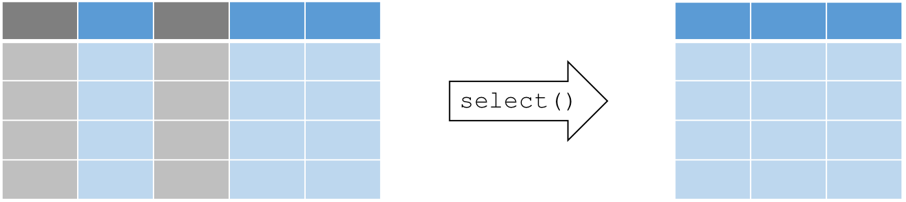
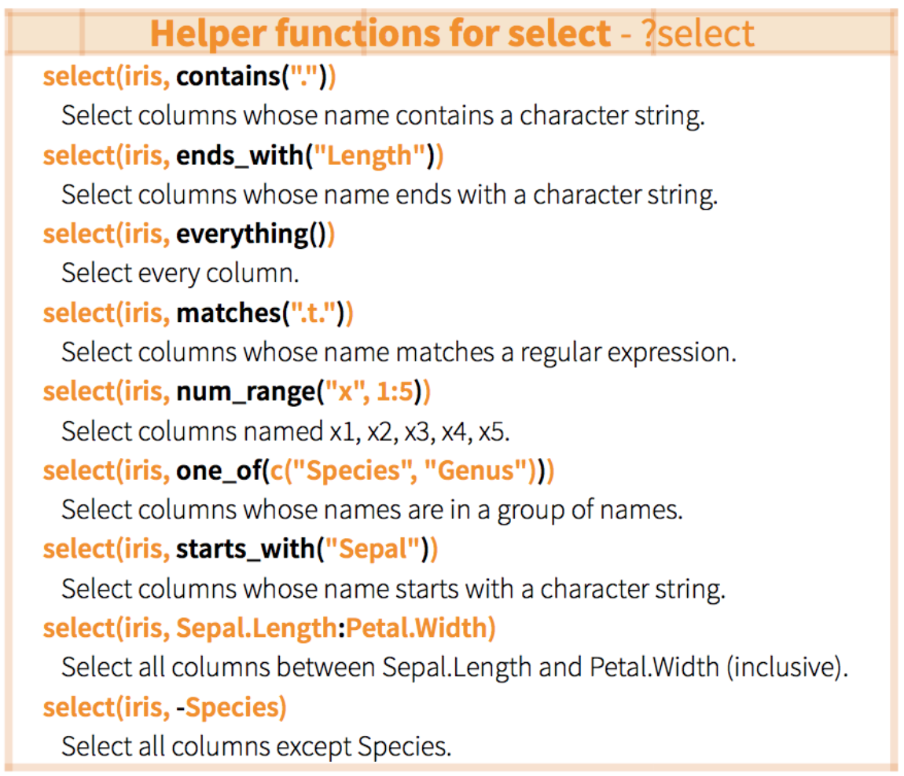
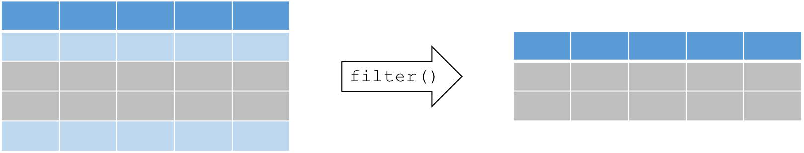

# Manipuler ses données avec tidyr, dyplr, maggritr

## Utiliser "tidyr" pour réorganiser ses données

{width="200"}

### Pourquoi réorganiser ses données?

La réorganisation permet de modifier la structure des données tout en
préservant l'information contenue dans le jeu de données. Plusieurs
fonctions dans R exigent ou fonctionnent mieux avec une structure de
données qui n'est pas nécessairement propice à la lecture par l'oeil
humain.

En comparaison à l'agrégation, où plusieurs cellules sont regroupées
pour créer un nouveau jeu de données (e.g. tableau des moyennes de
plusieurs variables), la réorganisation maintient le même nombre de
cellules. Le paquet `tidyr` permet de réorganiser nos jeu de données
dans un format idéal pour nos tâches en aval, et ce à l'aide d'une
syntaxe simple et logique.

Commençons par installer et charger le paquet `tidyr` :

```{r, echo = TRUE, eval = FALSE}
if(!require(tidyr)){install.packages("tidyr")}
library(tidyr)
```

### Données en longueur vs. en largeur

Un jeu de données **en largeur** contient une colonne pour chaque
variable ou facteur inclus dans les données. Une rangée peut alors
comprendre plusieurs observations différentes.

Un jeu de données **en longueur** contient une colonne par variable, où
chaque rangée s'agit d'une observation unique. Le format "long" est
plus "propre" (*tidy* en anglais), parce que les données sont plus
facilement interprétées par `R` pour nos visualisations et nos analyses.

Le format de vos données dépend de vos besoins d'analyse et de
visualisation, mais certains paquets et fonctions, incluant `dplyr`,
`lm()`, `glm()`, et `gam()`, nécessitent des données en longueur. Le
paquet `ggplot2` peut utiliser des données en largeur pour des
visualisations simples, mais fonctionne mieux avec des données en
longueur pour des visualisations plus complexes (exemple à venir).

De plus, les données en format long peuvent être agrégées et
réorganisées en format large afin de produire des résumés ou de vérifier
si un jeu de données est équilibré (i.e. avec le même nombre
d'observations par traitement).

On peut utiliser le paquet `tidyr` pour manipuler la structure d'un jeu
de données en préservant toutes les informations d'origine à l'aide
des fonctions suivantes:

-   1. "rassembler" les données (*gather data* en anglais; large
    \--\> long)
-   2. "disperser" les données (*spread data* en anglais; long \--\>
    large)

{width="600"}

Supposons que vous envoyez votre assistant de terrain pour faire la
collecte de données des dimensions de plusieurs arbres sur un site de
recherche, soit le diamètre à la hauteur de la poitrine (DHP) et la
hauteur. Il/elle revient avec un jeu de donnés en format "dégât"
(format large):

```{r, echo = TRUE, eval = FALSE}
> large <- data.frame(Species = c("Chêne", "Orme", "Frêne"),
                          DHP = c(12, 20, 13),
                         Haut = c(56, 85, 55))
> large
  Species DHP Haut
1   Chêne  12   56
2    Orme  20   85
3   Frêne  13   55
```

### gather(): Rassembler les données en longueur

```{r, echo = TRUE, eval = FALSE}
?gather
```

La plupart des paquets dans le "Hadleyverse" requièrent un format
long, c'est-à-dire où chaque rangée est une observation unique, et
chaque colonne est une variable. Utilisons la fonction `gather()` pour
"rassembler" nos données en longueur. `gather()` prend plusieurs
colonnes et les empile dans deux colonnes: une colonne spécifiant la
variable mesurée, et l'autre spécifiant la mesure associée.

La fonction `gather()` prend au moins 3 arguments:

-   **data**: le jeu de données (e.g. "large")
-   **key**: le nom de la nouvelle colonne spécifiant la variable
    mesurée (e.g. "dimension")
-   **value**: le nom de la nouvelle colonne spécifiant la mesure
    associée (e.g. "cm")
-   **...**: les colonnes qu'on veut empiler dans le jeu de données
    (e.g. "DBH", "Haut")

Voici une démonstration avec le jeu de données `large` utilisé
précédemment, contenant les dimensions d'arbres:

```{r, echo = TRUE, eval = FALSE}
# Rassembler les colonnes en rangées d'observations uniques

> long <- gather(large, dimension, cm, DHP, Haut)
> long
  Species dimension cm
1   Chêne       DHP 12
2    Orme       DHP 20
3   Frêne       DHP 13
4   Chêne      Haut 56
5    Orme      Haut 85
6   Frêne      Haut 55
```

Essayons également avec le jeu de données `CO2`. On peut "rassembler"
les colonnes contant la concentration de CO2 (`conc`) et le CO2 absorbé
(`uptake`) :

```{r, echo = TRUE, eval = FALSE}
CO2.long <- gather(CO2, response, value, conc, uptake)
head(CO2)
head(CO2.long)
tail(CO2.long)
```

### spread(): Disperser les données en largeur

```{r, echo = TRUE, eval = FALSE}
?spread
```

La fonction `spread()` est l'inverse de `gather()`: elle nous permet de
transformer nos données en format large, en utilisant la même syntaxe.
`spread()` prend 3 arguments principaux:

-   **data**: le jeu de données (e.g. "long")
-   **key**: nom de la colonne contenant les noms des variables (e.g.
    "dimension")
-   **value**: nom de la colonne contenant les mesures associées aux
    variables (e.g. "cm")

```{r, echo = TRUE, eval = FALSE}
> large2 <- spread(long, dimension, cm)
> large2
  Species DHP Haut
1   Chêne  12   56
2   Frêne  13   55
3    Orme  20   85
```

### separate(): séparer une colonne en deux (ou plusieurs) colonnes

Il arrive parfois qu'un jeu de données contient plusieurs variables
réunies dans une même colonne. Dans ces situations, la fonction
`separate()` sépare la colonne pour que chacune des variables ait sa
propre colonne.

La fonction `separate()` prend 4 arguments, et sépare une colonne à
partir d'une chaîne de caractères:

-   **data**: le jeu de données (e.g. "long")
-   **col**: nom de la colonne que nous voulons séparer
-   **into**: nom des nouvelles colonnes crées par la séparation
-   **sep**: le caractère ou la chaîne de caractères identifiant où
    séparer le contenu (e.g. " ")

À titre d'exemple, créons un jeu de données fictif sur les poissons et
le zooplancton qui est mal organisé:

```{r, echo = TRUE, eval = FALSE}
set.seed(8)
degat <- data.frame(id = 1:4,
                    trt = sample(rep(c('controle', 'culture'), each = 2)),
         zooplancton.T1 = runif(4),
             poisson.T1 = runif(4),
         zooplancton.T2 = runif(4),
             poisson.T2 = runif(4))
```

Dans ce cas, on commence par "rassembler" ce jeu de données en largeur
en format long.

```{r, echo = TRUE, eval = FALSE}
> degat.long <- gather(degat, taxa, count, -id, -trt)
> head(degat.long)
```

Petit rappel rapide: ici, nous utilisons `-id` et `-trt`, qui est
interprété par la fonction comme étant TOUTES les colonnes sauf `id` et
`trt`. Nous pourrions également énumérer chaque colonne comme ceci:
`zooplancton.T1, poisson.T1, zooplancton.T2, poisson.T2`.

Le défi principal de `separate()` est de formuler une expression qui
identifie le caractère sur lequel séparer la colonne. Dans notre
exemple, nous voulons séparer le contenu de la colonne "taxa" au point
(`.`). Il faut donc utiliser un petit truc provenant des outils
d'expressions régulières pour travailler avec les chaînes de caractères
(*strings* en anglais):

```{r, echo = TRUE, eval = FALSE}
> degat.long.sep <- separate(degat.long, taxa, into = c("especes", "temps"), sep = "\.")
> head(degat.long.sep)
  id      trt     especes temps     count
1  1 controle zooplancton    T1 0.3215092
2  2 controle zooplancton    T1 0.7189275
3  3  culture zooplancton    T1 0.2908734
4  4  culture zooplancton    T1 0.9322698
5  1 controle     poisson    T1 0.7691470
6  2 controle     poisson    T1 0.6444911
```

Ici, notons que la syntaxe `\.` est requise parce qu'un point seul
(`.`) est une carte frime (un joker) pour plusieurs fonctions dans le
langage `R`. Les `\\` servent donc à indiquer qu'on fait référence au
caractère "`.`".

### Récapitulatif: tidyr

`tidyr` est un paquet qui réorganise la structure de jeux de données.

-   Convertir de **format large en format long** à l'aide de `gather()`
-   Convertir de **format long en format large** à l'aide de `spread()`
-   Séparer et regrouper des colonnes à l'aide de `separate()` et de
    son inverse, `unite()`

Voici un aide-mémoire (*en anglais*) pour faciliter la manipulation de
jeux de données avec `tidyr` et `dplyr`:
<https://www.rstudio.com/wp-content/uploads/2015/02/data-wrangling-cheatsheet.pdf>

### DÉFI: Utiliser tidyr pour convertir le format long en format large

*Réorganisez le jeu de données `airquality` en format long (en
rassemblant toutes les colonnes sauf "Month" et "Day"). Ensuite,
dispersez-le en format large pour retrouver le format original de
`airquality`:*

++++Solution\|

```{r, echo = TRUE, eval = FALSE}
air.long <- gather(airquality, variable, value, -Month, -Day)
# Notez que la syntaxe ici indique qu'on veut "rassembler" toutes les colonnes sauf "Month" et "Day"
head(air.long)
air.wide <- spread(air.long , variable, value)
head(air.wide)
```

Le tableau `air.wide` a le même format que le jeu de données d'origine
`airquality` (bien que l'ordre des colonnes ne soit pas le même). ++++

------------------------------------------------------------------------

## Utiliser "dplyr" pour manipuler les données

{width="200"}

### Introduction à dplyr

Souvent, on doit faire appel à une gamme d'outils complexes pour
manipuler nos jeux de données. La mission de `dplyr` est de simplifier
nos tâches de manipulation en regroupant toutes les opérations communes
sous un même toit. Le résultat est une collection de fonctions ayant une
syntaxe simple qu'on peut exécuter à l'aide de "verbes" (ou
fonctions) intuitifs.

En plus d'être facile à utiliser, le paquet `dplyr` est exceptionnel
pour les raisons suivantes:

-   il peut traiter des grands jeux de données rapidement (écrit en
    langage `Cpp`)
-   sa fonctionnalité est bien intégrée dans RStudio et dans les autres
    paquets du Hadleyverse
-   il peut établir des connections à des bases de données SQL, et
    traduire votre code en requête SQL
-   c'est le Batman des paquets `R` (maîtrise la peur des données et
    adopte des technologies avancées)

Certaines fonctions de base dans R ressemblent à des fonctions dans
`dplyr`, incluant: `split()`, `subset()`, `apply()`, `sapply()`,
`lapply()`, `tapply()` and `aggregate()`.

Commençons par installer et charger le paquet `dplyr`:

```{r, echo = TRUE, eval = FALSE}
if(!require(dplyr)){install.packages("dplyr")}
library(dplyr)
```

Au coeur du paquet `dplyr`, on retrouve des "verbes" essentiels qui
nous permettent d'accomplir la manipulation de données. Voici 4 verbes
qui exécutent les opérations les plus communes:

-   `select()` : sélectionne des colonnes dans un jeu de données
-   `filter()` : filtre des rangées suivant les critères spécifiés
-   `arrange()` : trie les données d'une colonne en ordre croissant ou
    décroissant
-   `mutate()` : crée une nouvelle colonne de données (ou transforme une
    colonne existante)

Dans les exemples et les défis qui suivent, nous utiliserons les jeux de
données `airquality` et `ChickWeight`, qui sont inclus dans R:

```{r, echo = TRUE, eval = FALSE}
?airquality
data(airquality)
?ChickWeight
data(ChickWeight)
```

### select(): Sélection de colonnes

{width="600"}

La syntaxe de la fonction `select()` est:
`select(données, colonne1, colonne2, ...)`. La majorité de fonctions
`dplyr` suivent cette même syntaxe. `select()` prend alors au moins 2
arguments:

-   **data**: le jeu de données
-   **...**: noms ou positions de colonnes, ou expressions complexes
    (séparés par des virgules pour désigner les colonnes que l'on veut
    sélectionner

Par exemple:

```{r, echo = TRUE, eval = FALSE}
select(données, colonne1, colonne2) # sélectionne colonne1 et colonne2
select(données, c(2:4,6) # sélectionne les colonnes 2 à 4, plus la 6ème colonne
select(données, -colonne1) # sélectionne toutes les colonnes sauf la 1ère
select(données, start_with(x.)) # sélectionne les colonnes ayant un nom qui commence par "x."
```

Voici d'autres arguments utiles pour `select()`:

{width="400"}

À titre d'exemple, supposons qu'on s'intéresse à la variation de la
variable `Ozone` avec le temps. À l'aide de la fonction `select()`, on
peut retenir uniquement les colonnes requises pour nos analyses :

```{r, echo = TRUE, eval = FALSE}
> ozone <- select(airquality, Ozone, Month, Day)
> head(ozone)
  Ozone Month Day
1    41     5   1
2    36     5   2
3    12     5   3
4    18     5   4
5    NA     5   5
6    28     5   6
```

### filter(): Sélection de rangées

Souvent, on s'intéresse seulement à un sous-ensemble de notre jeu de
données. Pour extraire un sous-ensemble de rangées selon une condition,
on peut utiliser la fonction `filter()` avec la syntaxe suivante:
`filter(dataframe, proposition logique 1, proposition logique 2, ...)`.

{width="600"}

On se rappelle que la réponse à une proposition logique est VRAI ou FAUX
(TRUE or FALSE). La fonction `filter()` retient uniquement les rangées
pour lesquelles la réponse à la proposition logique est VRAI. On peut
aussi utiliser cette fonction sur des chaînes de caractères (*strings*)
et des facteurs (*factors*).

Voici un petit rappel du fonctionnement des propositions logiques dans
R: {width="500"}

Par exemple, supposons qu'on s'intéresse aux périodes de canicules du
mois d'août dans le jeu de données `airquality` :

```{r, echo = TRUE, eval = FALSE}
> aout <- filter(airquality, Month == 8, Temp >= 90)
> head(aout)
  Ozone Solar.R Wind Temp Month Day
1    89     229 10.3   90     8   8
2   110     207  8.0   90     8   9
3    NA     222  8.6   92     8  10
4    76     203  9.7   97     8  28
5   118     225  2.3   94     8  29
6    84     237  6.3   96     8  30
```

### arrange(): Triage de rangées

Parfois, on travaille avec des jeux de données qui doivent être analysés
et/ou visualisés dans un ordre en particulier (*e.g.* série temporelle).

La fonction `arrange()` permet de trier les rangées d'un jeu de données
selon une ou plusieurs colonnes, suivant cette syntaxe:
`arrange(données, variable1, variable2, ...)`.

Par défaut, les rangées sont réordonnées en ordre croissant
(alphabétiquement ou numériquement). On peut également réordonner les
rangées en ordre décroissant en enveloppant la variable d'intérêt par
la fonction `desc()` au sein de la fonction `arrange()`, comme ceci:
`arrange(données, variable1, desc(variable2), ...)`.

Commençons par créer une version désordonnée de `airquality`:

```{r, echo = TRUE, eval = FALSE}
> air_degat <- sample_frac(airquality, 1)
> head(air_degat)
    Ozone Solar.R Wind Temp Month Day
21      1       8  9.7   59     5  21
42     NA     259 10.9   93     6  11
151    14     191 14.3   75     9  28
108    22      71 10.3   77     8  16
8      19      99 13.8   59     5   8
104    44     192 11.5   86     8  12
```

Maintenant, voici comment réarranger le jeu de données en ordre
chronologique, soit en ordre croissant de `Month` et ensuite en ordre
croissant de `Day` :

```{r, echo = TRUE, eval = FALSE}
> air_chron <- arrange(air_degat, Month, Day)
> head(air_chron)
  Ozone Solar.R Wind Temp Month Day
1    41     190  7.4   67     5   1
2    36     118  8.0   72     5   2
3    12     149 12.6   74     5   3
4    18     313 11.5   62     5   4
5    NA      NA 14.3   56     5   5
6    28      NA 14.9   66     5   6
```

Quelle est la différence quand on change l'ordre des colonnes ciblées
par la fonction?

```{r, echo = TRUE, eval = FALSE}
arrange(air_mess, Day, Month)
```

### mutate(): Créer des nouvelles colonnes

Avant même de passer au triage ou à l'extraction d'un sous-ensemble de
données, il faut souvent générer des nouvelles variables ou transformer
des variables existantes. On peut utiliser la fonction `mutate()` pour
créer et transformer des variables.

La fonction `mutate()` suit la syntaxe suivante:
`mutate(données, newVar1 = expression1, newVar2 = expression2, ...)`.

{width="600"}

Utilisons `mutate()` pour créer une nouvelle colonne. Par exemple, la
température est en degrés Fahrenheit dans le jeu de données
`airquality`, et nous voulons transformer la variable `Temp` en degrés
Celsius:

```{r, echo = TRUE, eval = FALSE}
> airquality_C <- mutate(airquality, Temp_C = (Temp-32)*(5/9))
> head(airquality_C)
  Ozone Solar.R Wind Temp Month Day   Temp_C
1    41     190  7.4   67     5   1 19.44444
2    36     118  8.0   72     5   2 22.22222
3    12     149 12.6   74     5   3 23.33333
4    18     313 11.5   62     5   4 16.66667
5    NA      NA 14.3   56     5   5 13.33333
6    28      NA 14.9   66     5   6 18.88889
```

Notez que dans notre exemple, la syntaxe est très simple. Cependant, à
l'intérieur d'un seul appel de la fonction `mutate()` on peut:

-   remplacer le contenu de colonnes existantes (en conservant le même
    nom)
-   créer plusieurs nouvelles colonnes
-   créer des nouvelles colonnes calculées à partir de variables créés
    en amont

## dplyr et magrittr, un don du ciel

{width="200"}

Le paquet `magrittr` introduit un nouvel outil commun dans plusieurs
langages informatiques : le **pipe**. Le "pipe" (un tuyau en français)
permet de relier nos fonctions en redirigeant la sortie (*output*)
d'une fonction en amont vers l'entrée (*input*) d'une fonction en
aval. Le "pipe" fournit par le paquet `magrittr` s'écrit come ceci :
`%>%`. Lorsqu'on l'utilise en combo avec `dplyr`, le "pipe" de
`magrittr` nous permet d'accéder à la flexibilité et à toutes les
fonctionnalités intéressantes du paquet. Pour vous familiariser avec ce
type de flux de travail, nous utiliserons `dplyr` avec `magrittr` pour
le restant de l'atelier.

Commençons par installer et charger le paquet :

```{r, echo = TRUE, eval = FALSE}
if(!require(magrittr)){install.packages("magrittr")}
library(magrittr)
```

L'utilisation de `magrittr` est très intuitif. Nous allons démontrer
son fonctionnement en combinant les exemples ci-haut. Supposons qu'on
veut créer un sous-ensemble de `airquality` pour le mois de juin, et
ensuite convertir la variable de la température en degrés Celsius. Si on
procède sans le "pipe", soit une étape à la fois, notre code lirait
comme suit :

```{r, echo = TRUE, eval = FALSE}
juin_C <- mutate(filter(airquality, Month == 6), Temp_C = (Temp-32)*(5/9))
```

Ce code est plus difficile à lire parce que l'ordre des opérations
exécutées commence au centre et se lit vers l'extérieur, jusqu'à la
fonction enveloppant le tout. Plus on ajoute des opérations, plus le
code devient illisible. Au lieu d'envelopper tous les fonctions, on
peut écrire les opérations en ordre d'exécutions et les relier à
l'aide du "pipe" `%>%` :

```{r, echo = TRUE, eval = FALSE}
juin_C <- airquality %>%
    filter(Month == 6) %>%
    mutate(Temp_C = (Temp-32)*(5/9))
```

Notez qu'au lieu de spécifier le jeu de données au sein de chaque
fonction, on inscrit le jeu de données avant les opérations et on le
"pipe" jusqu'à la prochaine fonction à l'aide de `%>%`.

En utilisant le "pipe", le code est moins redondant. De plus, il se
lit et s'écrit dans le même ordre que l'exécution des opérations, ce
qui facilite et accélère la traduction de nos pensées en code, ainsi que
la lecture et la compréhension du code écrit par nos collègues. Lorsque
nos opérations de manipulation de données deviennent plus complexes et
requièrent plusieurs étapes, on s'aperçoit rapidement que `magrittr`
offre une approche puissante et élégante pour la rédaction de notre code
`dplyr`.

**BONUS :** Dans RStudio, on peut insérer le "pipe" rapidement avec la
combinaison des touches suivantes: `Ctrl` (or `Cmd` sur Mac)
+`Shift`+`M`.

## Regroupement d'opérations et sommaires avec "dplyr"

Les verbes `dplyr` que nous avons utilisés dans cet atelier sont utiles
individuellement, mais deviennent particulièrement puissants quand ils
sont reliés par le "pipe" (`%>%`), et lorsqu'on les applique sur des
sous-ensembles de données. Les fonctions `dplyr` suivantes nous
permettent de séparer nos jeu de données en groupes distincts sur
lesquels on peut exécuter des opérations individuelles, comme des
fonctions d'aggrégation et de sommaire:

-   `group_by()`: regrouper le jeu de données par un facteur pour les
    opérations en aval (comme `summarise`)
-   `summarise()`: créer un sommaire de variables au sein de groupes
    distincts dans un jeu de données en utilisant des fonctions
    d'aggrégation (*e.g.* `min()`, `max()`, `mean()`, etc...)

Ces deux verbes fournissent la structure requise pour la stratégie
Séparer-Appliquer-Combiner ("Split-Apply-Combine") originalement
introduite dans le paquet `plyr`, l'ancêtre de `dplyr`.

{width="600"}

Utilisons ces deux fonctions pour générer un sommaire du jeu de données
`airquality` qui montre la température moyenne et l'écart type pour
chaque mois:

```{r, echo = TRUE, eval = FALSE}
> mois_moy <- airquality %>%
      group_by(Month) %>%
      summarise(mean_temp = mean(Temp),
                sd_temp = sd(Temp))
mois_moy
Source: local data frame [5 x 3]

  Month mean_temp  sd_temp
  (int)     (dbl)    (dbl)
1     5  65.54839 6.854870
2     6  79.10000 6.598589
3     7  83.90323 4.315513
4     8  83.96774 6.585256
5     9  76.90000 8.355671
```

------------------------------------------------------------------------

### DÉFI: dplyr et magrittr

*En utilisant le jeu de données `ChickWeight`, créez un tableau sommaire
dans lequel on retrouve la différence de masse entre le maximum et le
minimum de la masse enregistré pour chaque poussin dans l'étude.
Utilisez les verbes `dplyr` et le "pipe" `%>%`.*

```{r, echo = TRUE, eval = FALSE}
?ChickWeight
data(ChickWeight)
```

++++Solution\|

```{r, echo = TRUE, eval = FALSE}
> mass_diff <- ChickWeight %>%
     group_by(Chick) %>%
     summarise(mass_diff = max(weight) - min(weight))
> mass_diff
Source: local data frame [50 x 2]

    Chick weight_diff
   (fctr)       (dbl)
1      18           4
2      16          16
3      15          27
4      13          55
5       9          58
6      20          76
7      10          83
8       8          92
9      17         100
10     19         114
..    ...         ...
```

Notez qu'ici on mesure simplement la différence de masse entre le
maximum et le minimum. Il ne s'agit donc pas de la différence de masse
entre le début et la fin de l'étude (différence en ordre chronologique
de la masse). Inspectez de plus près les observations liées au poussin
\# 18 :

```{r, echo = TRUE, eval = FALSE}
> poussin_18 <- ChickWeight %>% filter(Chick == 18)
> poussin_18
  weight Time Chick Diet
1     39    0    18    1
2     35    2    18    1
```

On s'aperçoit que le poussin a perdu de la masse (il est probablement
décédé, puisqu'il a seulement 2 observations). D'un point de vue
scientifique, on pourrait s'intéresser davantage à la question: quelle
alimentation engendre un gain de masse plus important chez les poussins
individuels? On pourrait donc calculer la différence de masse entre le
début et la fin avec deux autres fonctions utiles dans `dplyr` :
`first()` et `last()` nous permettent d'accéder à la première et la
deuxième observation d'un sous-groupe, respectivement. ++++

### Indice pour les ninjas

Notez qu'on peut regrouper un jeu de données par plus qu'un facteur,
en suivant la syntaxe suivante :

`group_by(groupe1, groupe2, ...)`

Au sein de "group_by()", on peut regrouper par plusieurs variables
pour créer un "oignon" de sous-groupes. Chaque fois qu'on utilise la
fonction `summarise()`, elle élimine une couche de l'oignon en
commençant par la couche extérieure, donc la dernière variable dans
`group_by()` qui s'agit de `groupe2` dans cet exemple. Ainsi, dans
l'exemple ci-haut, si on utilise la fonction `summarise()` une seule
fois en aval:

`group_by(groupe1, groupe2) %>% summarise(x = mean(y))`

Le `groupe2` est éliminé, et le jeu de données devient ensuite groupé
par `groupe1`.

### NINJA DÉFI: dplyr & magrittr

// En utilisant le jeu de données `ChickWeight`, créez un tableau
sommaire qui indique pour chaque `Diet`, la moyenne de la différence de
masse entre la fin et le début de l'étude pour chaque poussin. Utilisez
les verbes `dplyr` et le pipe `%>%`. (Indice : les fonctions `first()`
et `last()` pourraient s'avérer utiles).//

++++Solution\|

```{r, echo = TRUE, eval = FALSE}
> diet_mass <- ChickWeight %>%
      group_by(Diet, Chick) %>%
      summarise(gain_masse = last(weight) - first(weight)) %>%
      summarise(gain_moyen = mean(gain_masse))
> diet_mass
Source: local data frame [4 x 2]

    Diet gain_moyen
  (fctr)      (dbl)
1      1      114.9
2      2      174.0
3      3      229.5
4      4      188.3
```

Cette solution démontre bien la simplicité et l'élégance de la syntaxe
de `dplyr` et `magrittr` quand nous devons manipuler nos données en
plusieurs étapes consécutives. Un défi encore plus difficile, même pour
ceux qui sont experts en `R` de base, serait de reproduire les mêmes
opérations avec moins de code. Nous avons essayé et nous avons
échoué... Peut-être nous sommes trop habitués à `dplyr` maintenant!

++++

## Fusionner des tableaux de données avec dplyr

En plus des fonctions que nous avons explorées aujourd'hui, `dplyr`
offre d'autres fonctions forts utiles nous permettant de fusionner des
tableau de données, avec une syntaxe relativement simple :

-   `left_join()`
-   `right_join()`
-   `inner_join()`
-   `anti_join()`

Ces fonctions vont au-delà du matériel d'introduction dans cet atelier,
mais ils offrent des fonctionnalités pouvant être très utiles pour des
manipulations de données plus complexes.