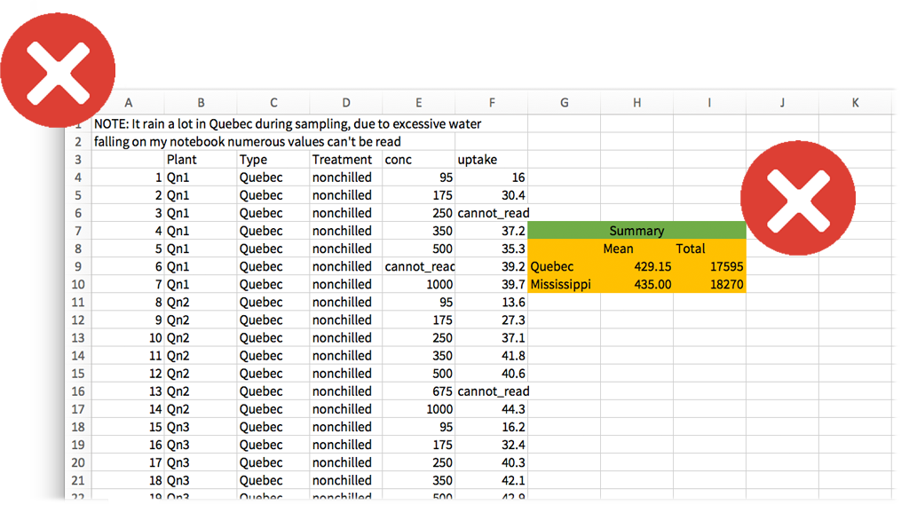

```{r setup, echo = FALSE}
knitr::opts_chunk$set(
  comment = "#",
  collapse = TRUE,
  warning = FALSE,
  message = FALSE,
  cache = TRUE,
  fig.width=5, fig.height=5, 
  fig.retina=3,
  fig.align = 'center'
)
options(repos=structure(c(CRAN="http://cran.r-project.org")))
```

class: inverse, center, middle

```{r install_pkgs, message=FALSE, warning=FALSE, include=FALSE, results=0}
# Standard procedure to check and install packages and their dependencies, if needed.

list.of.packages <- c("dplyr", "tidyr", "magrittr")

new.packages <- list.of.packages[!(list.of.packages %in% installed.packages()[,"Package"])]

if(length(new.packages) > 0) {
  install.packages(new.packages, dependencies = TRUE) 
  print(paste0("The following package was installed:", new.packages)) 
} else if(length(new.packages) == 0) {
    print("All packages were already installed previously")
  }
```

# About this workshop

[](https://qcbsrworkshops.github.io/workshop02/pres-en/workshop02-pres-en.html) | [](https://qcbsrworkshops.github.io/workshop02/book-en/index.html) | [](https://wiki.qcbs.ca/r_workshop2) | [](https://qcbsrworkshops.github.io/workshop02/book-en/workshop02-script-en.R) | [](https://github.com/QCBSRworkshops/workshop02) 

---

# Required packages

* [dplyr](https://cran.r-project.org/package=dplyr)
* [tidyr](https://cran.r-project.org/package=tidyr)
* [magrittr](https://cran.r-project.org/package=magrittr)

<br>

```R
install.packages(c('dplyr', 'tidyr', 'magrittr'))
```

---

# Learning Objectives

<br>
##### 1. Creating an R project
##### 2. Writing a script
##### 3. Loading, exploring, and saving data
##### 4. Learn to manipulate data frames with `tidyr`, `dplyr`, and `maggritr`

---
class: inverse, center, middle

# Creating an R project

<hr>

---
# RStudio projects

<br>
<br>
- Projects make easy to keep your work organized.
<br>
<br>
- All files, scripts, and documentation related to a specific project are bound together with a *.Rproj* file
<br>
<br>

.alert[Encourages reproducible code!]


---
# Creating a new project

Use the **New project** command

(available in the global toolbar: *File* -> *New Project*)

.center[
]


---
# One project = one folder

Keep your files organized!

.center[
]


---
# Preparing data for R

Dataset should be stored as *comma-separated value* files (`.csv`) in the working directory

* Can be created from almost all applications (Excel, LibreOffice, Google Docs)
* `File -> Save as .csv…`

.center[
]


---
# Naming files

Avoid using spaces, accents or special characters within filenames.

<br>
<br>
.pull-left[
**Recommended**
- `rawDatasetAgo2017.csv`
- `co2_concentrations_QB.csv`
- `01_figIntro.R`
]

.pull-right[
**Not recommended**
- `final.csv`
- `safnnejs.csv`
- `1-4.csv`
]


---
# Naming variables

Avoid using spaces, accents or special characters within variable names.

Use separators (e.g. "\_") to add details

<br>
<br>
.pull-left[
**Recommended**
  - `Measurements`
  - `speciesNames`
  - `Site_001_Rep_002`
  ]
  
.pull-right[
**Not recommended**
 - `a`
 - `3`
 - `complicatedverylongname`
 ]

<br>
<br>
.center[Check the [tidyverse style guide](https://style.tidyverse.org/) for recommended coding habits.]


---
# Common data preparation mistakes

<br>
Here are a few examples of mistakes that originate confusion when preparing and manipulating data:

.pull-left[
* text in numeric columns;
* typos;
* numeric names for non-numeric data;]

.pull-right[
* inconsistent formats for dates, numbers, metrics, and other units;
* incorrect headings;
* merged cells.
]

<br>
<br>
Read the publication by [Broman & Woo (2017)](https://doi.org/10.1080/00031305.2017.1375989) 
on useful tips on data organization in spreadsheets. 

---
# Non-recommended data tables

.pull-left[
]

.pull-right[

]

---
# **Horrible** data sheets

Not the best practices for data preservation and interoperability

.center[
]

---
# Preparing data in `R`
<br>
<br>
It is possible to prepare your data entirely within `R` as it:

* Saves time for large datasets;
* Keeps original data intact;
* Keeps track of the manipulation and transformation you did; and,
* Can switch between long- and wide-formats easily (more details later).


.center[Useful tips on data preparation can be found here: https://www.zoology.ubc.ca/~schluter/R/data/]

---
class: inverse, center, middle

# Writing a Script

---
# `R` Scripts
<br>
<br>
* What is a script?
   - A text file storing the commands used for a particular analysis

* Once written and saved, your script file allows you to make changes and re-run analyses with minimal effort!
  - Just highlight text and click "Run" or press `Command + Enter` (Apple) or `Ctrl + Enter` / `Ctrl + R` (Windows and Linux)


---
# Creating an `R` script

.center[

]

---
# Creating an `R` script


.center[

]


---
# Commands and comments
<br>
The `#` symbol in a script tells `R` to **not run** and ignore anything written past it within the same line

<br>
<br>

.pull-left[
```{r, eval = FALSE}
a <- 1 + 1
# This is a comment
```
]

.pull-right[
```{r, eval = FALSE}
b <- 2 + 2 # This is a comment
```
]

---
# Why should I use `#`?
<br>
<br>
* Annotating someone’s script is a good way to learn;
* Tell collaborators what you did;
* Good step towards reproducible science.

<br>

.center[Be as detailed as possible!]


---
# Header
<br>
It is recommended that you start your script with a header using comments:

.center[

]


---
# Section Headings
<br>
You can make a section heading in R Studio with four `#` signs

```{r, eval = FALSE}
# You can comment using this. 

# Look below how to create section headers:

#### Heading name ####

# You can also do this:

# Section One ---------------------------------
# Section Two =================================
### Section Three #############################

```

This allows you to move quickly between sections and hide sections

.center[

]


---
# Preparing your `R` Environment: Housekeeping
<br>

The first command at the top of all scripts may be: `rm(list = ls())`.

This command:

* Clears objects from the memory and the disk;
* Prevents errors related to the use of out-dated data.

<br>

```{r, eval = FALSE}
# Clear the R Workspace
rm(list = ls())

?rm
?ls
```

---
# Preparing your `R` Environment: Housekeeping

**DIY**: Try adding some test data to `R` and then see how `rm(list = ls())` removes it

```{r, eval = FALSE}
A<-"Test" # Put some data in workspace
A <- "Test" # Add some spaces to organize your data!
A = "Test" # You can do this, but it does not mean you should

# Check objects in the workspace
ls()
# [1] "A"

A
# [1] "Test"

# Clean Workspace
rm(list=ls())

A
```

```{r, eval = FALSE}
# Error in eval(expr, envir, enclos): object 'A' not found
```


---
# Remember
<br>
<br>
* `R` is ready for commands when you see the chevron `>` in the console. If you do not see it, press `Esc`
<br>
<br>
* `R` is case sensitive!


---
class: inverse, center, middle

# Loading, exploring and saving data

---
# Download today's data
<br>
You can download the data and the script for this workshop from the wiki:

.center[http://qcbs.ca/wiki/r/workshop2]

Save the files in the folder where your created your `R` project.

--

<br>

.alert[NOTE] Many databases are already available within `R`

```{r, eval = FALSE}
# Complete list of available data on base R
library(help = "datasets")
```

---
# Working Directory

If you are not using an RStudio project, you have to tell R where your scripts and data are.Type `getwd()` in the console to see your current working directory:

```{r, eval = FALSE}
getwd()
```

If you want to change your working directory use `setwd()`: 

```{r, eval = FALSE}
setwd("C:/Users/my_new_path")
```

.comment[It is recommended to create an RStudio project and avoid using `setwd()` to promote reproducibility]

---
# Display contents of the directory
<br>
<br>
You can display contents of the working directory using `dir()`:

```{r, eval = TRUE}
dir()
```

It helps to:

* Check that the file you plan to open is present in the folder that R is currently working in
* Check for correct spelling (e.g. `co2_good.csv` instead of `CO2_good.csv`)

---
# Importing Data
<br>
<br>
Import data into `R` using `read.csv()`:

```{r, eval = TRUE}
CO2 <- read.csv("data/co2_good.csv", header=TRUE)
```

Note that this will:
* Create a new object in R called `CO2`;
* The file name is written within quotation marks ('file' or "file");
* If you needed to fetch the file name from another directory that is not yours, you would have to write the full extension (e.g., `"C:/Users/Mario/Downloads/co2_good.csv"`)
* `header=TRUE` tells R that the first line of your dataset contains column names

---
# Importing Data
<br>
<br>
.alert[Recall] to find out what arguments the function requires, use help “?”
I
```{r, eval = FALSE}
?read.csv
```

.alert[Note] that if your operating system or `CSV` editor (e.g. Excel) is in French, you may have to use `read.csv2()`

```{r, eval = FALSE}
?read.csv2
```

---
# Importing Data

.center[

]

Notice that RStudio now provides information on the CO2 data in your **workspace**.

The **workspace** refers to all the objects that you create during an R session.


---
# Inspecting the data

R Command  					| Action
----------------- | -------------
`CO2`					  		| look at the whole dataframe
`view(CO2)`         | look data as a spreadsheet
`head(CO2)`		  		| look at the first few rows
`tail(CO2)`         | look at the last few rows
`names(CO2)`				| names of the columns in the dataframe
`attributes(CO2)`		| attributes of the dataframe
`dim(CO2)`          | dimensions of the dataframe
`ncol(CO2)`					| number of columns
`nrow(CO2)`					| number of rows
`summary(CO2)`      | basic statistics for each variables

.small[.alert[NOTE] These functions could also be used with other objects such as `vector`, `matrix`, `list`, `array`, etc.]

---
# Inspecting the data
<br>
<br>
```{r, eval = TRUE}
str(CO2)
```
This shows the structure of the dataframe.
Very useful to check data type (mode) of all columns to make sure R loaded data properly.

.small[Note: the CO2 dataset includes repeated measurements of CO2 uptake from 6 plants from Quebec and 6 plants from Mississippi at several levels of CO2 concentration. Half the plants of each type were chilled overnight before the experiment was conducted.]


---
# Inspecting the data
<br>
<br>
**Common problems:**

* Factors loaded as text (character) or viceversa
* Factors includes too many (and unexpected) levels because of typos
* Data (integer or numeric) is loaded as character because of typos (*e.g.* a space or a "," instead of a "." to separate decimal numbers)

---
# Exercise

<br>
<br>
Load the data with:

```{r, eval = FALSE}
CO2 <- read.csv("data/co2_good.csv", header = FALSE)
```

Check data types with `str()` again.

What is wrong here?

--

.comment[Do not forget to re-load data with `header = TRUE` afterwards]

---
# Reminder from Workshop 1: Accessing data

Imagine a data frame called `mydata`:

.center[

]

```{r, eval = FALSE}
mydata[1,] # Extracts the first row
mydata[2,3] # Extracts the content of row 2 / column 3
mydata[,1] # Extracts the first column
mydata[,1][2] # [...] can be also be used recursively
mydata$Variable1 # Also extracts the first column
```

---
# Renaming variables

Variables names can be changed within R.

```{r, eval = TRUE}
# First lets make a copy of the dataset to play with
CO2copy <- CO2
# names() gives you the names of
# the variables present in the data frame
names(CO2copy)

# Changing from English to French names 
# (make sure you have the same levels!)
names(CO2copy) <- c("Plante","Categorie", 
                    "Traitement", "conc",
                    "absortion")
names(CO2copy)
```

---
# Creating new variables

Variables and strings can be concatenated together.
The function `paste()` is very useful for concatenating.
See `?paste` and `?paste0`.


```{r, eval = TRUE}
# Let us create an unique id for our samples:
# Do not forget to use "" for strings
CO2copy$uniqueID <- paste0(CO2copy$Plante,
                           "_",CO2copy$Categorie,
                           "_", CO2copy$Traitement)

# observe the results
head(CO2copy$uniqueID)
```

---
# Creating new variables

Creating new variables works for numbers and mathematical operations as well!

```{r, eval = FALSE}
# Let us standardize our variable "absortion" to relative values
CO2copy$absortionRel <- CO2copy$absortion/max(CO2copy$absortion)

# Observe the results
head(CO2copy$absortionRel)
```

---
# Subsetting data

There are many ways to subset a data frame

```{r, eval = FALSE}
# Let us keep working with our CO2copy data frame

# Select only "Plante" and "absortionRel" columns.
# (Do not forget the ","!)

CO2copy[,c("Plante", "absortionRel")]

# Subset data frame from rows from 1 to 50
CO2copy[1:50,]
```


---
# Subsetting data

```{r, eval = F}
# Select observations matching only the nonchilled Traitement.
CO2copy[CO2copy$Traitement == "nonchilled",]

# Select observations with absortion 
# higher or equal to 20
CO2copy[CO2copy$absortion >= 20, ]

# Select observations with absortion 
# higher or equal to 20
CO2copy[CO2copy$Traitement  == "nonchilled" &
          CO2copy$absortion >= 20, ]

# We are done playing with the Dataset copy, lets erase it.
CO2copy <- NULL
```

Go [here](https://stat.ethz.ch/R-manual/R-devel/library/base/html/Logic.html) to check all the logical operators you can use

---
# Data exploration
<br>
<br>
A good way to start your data exploration is to look at some basic statistics of your dataset.

Use the `summary()` function to do that!

```{r, eval = FALSE}
summary(CO2)
```

This is also useful to spot some errors you might have missed!

---
# Data exploration

You can also use other functions to calculate basic statistics on parts of your data frame. Let us try the `mean()`, `sd()` and `hist()` functions:

```{r, eval = TRUE}
# Calculate the mean and the standard deviation 
# of the CO2 concentration:
# Assign them to new variables
meanConc <- mean(CO2$conc)
sdConc <- sd(CO2$conc)
```

```{r, eval = TRUE}
# print() prints any given value to the R console
print(paste("the mean of concentration is:", meanConc))

print(paste("the standard deviation of concentration is:", sdConc))
```

---
# Data exploration

```{r, eval = TRUE, fig.width=6, fig.height=6}
# Let us plot a histogram to explore the distribution of "uptake"
hist(CO2$uptake)
```

---
# Data exploration

```{r, eval = TRUE, fig.width=6, fig.height=6}
# Increasing the number of bins to observe better the pattern
hist(CO2$uptake, breaks = 40)
```


---
# Saving your Workspace


```{r, eval = F}
# Saving an R workspace file that stores all your objects
save.image(file="data/co2_project_Data.RData")


# Clear your memory
rm(list = ls())


# Reload your data
load("data/co2_project_Data.RData")
head(CO2) # Looking good!
```

```{r, echo = FALSE}
head(CO2)
```

---
# Exporting data

R disposes of `write` functions that allow you to write objects directly to files in your computer. Let us use the `write.csv()` function to save our CO2 data into a .CSV file:

```{r, eval = FALSE}
write.csv(CO2, file = "data/co2_new.csv")
```

Note that our arguments are both:

`CO2`  Object (name)

`"co2_new.csv"`  File to write (name)


---
instruction: hidden_remote

# Challenge: Use your data 
<br>
<br>
* Try to load, explore, plot, and save your own data in R;
* If it does not load properly, try to make the appropriate changes;
* When you are finished, try opening your exported data in Excel, Numbers, Notepad or TextEdit.

.comment[If you don’t have your own data, work with your neighbor]

.comment[Remember to clean your workspace]


---
class: inverse, center, middle

# Database repair

---
# Database repair
<br>
Getting your data working properly can be tougher than you think!
<br>

For example, sharing data from an Apple computer to Windows, or between computers set up in different continents can lead to incompatible files (e.g. different decimal separators).

Let us practice how to solve these common errors.

---
# Database repair

Exercise:

Read the file `co2_broken.csv`

```{r, eval = TRUE}
CO2 <- read.csv("data/co2_broken.csv")
head(CO2)
```


---
# Database repair

Some useful functions:

* `head()` - first few rows
* `str()` - structure of data
* `class()` - class of the object
* `unique()` - unique observations
* `levels()` - levels of a factor
* `which()` - ask a question to your data frame
* `droplevels()` - get rid of undesired levels after sub setting factors

add "?" (e.g. `?read.csv` to the function name to access the function help page)

<br>
.alert[HINT] There are 4 problems!


---
# Database repair

.alert[ERROR 1] The data appears to be lumped into one column

```{r, eval = TRUE}
head(CO2)
```

---
# Database repair

.alert[ERROR 1] - Solution

* Re-import the data, but specify the separation among entries
* The sep argument tells R what character separates the values on each line of the file
* Here, "TAB" was used instead of ","

```{r, eval = TRUE}
CO2 <- read.csv("data/co2_broken.csv",sep = "")
```

---
# Database repair

.alert[ERROR 2] The data does not start until the third line of the file, so you end up with notes on the file as the headings.

```{r, eval = TRUE}
head(CO2)
```


---
# Database repair

.alert[ERROR 2] - Solution

Skip two lines when loading the file using the "skip" argument:

```{r, eval = TRUE}
CO2 <- read.csv("data/co2_broken.csv", sep = "", skip = 2)
head(CO2)
```

---
# Database repair

.alert[ERROR 3] `conc` and `uptake` variables are considered factors instead of numbers, because there are comments in the numeric columns

```{r, eval = TRUE}
str(CO2)
```

```{r, eval = TRUE}
unique(CO2$conc)
```

* Due to missing values entered as "cannot_read_notes" and "na"
* Recall that R only recognizes "NA" (capital)

---
# `?read.csv`


---
# Database repair

.alert[ERROR 3] - Solution

Tell R that all of NA, "na", and "cannot_read_notes" should be considered NA. Then because all other values in those columns are numbers, `conc` and `uptake` will be loaded as numeric/integer.


```{r, eval = TRUE}
CO2 <- read.csv("data/co2_broken.csv",
                sep = "", skip = 2,
                na.strings = c("NA","na",
                               "cannot_read_notes"))
str(CO2)
```

---
# Database repair

.alert[ERROR 4]

There are only 2 treatments (chilled and non-chilled) but there are spelling errors causing it to look like 4 different treatments.

```{r, eval = FALSE}
str(CO2)
```

```{r, eval = TRUE}
levels(CO2$Treatment)
unique(CO2$Treatment)
```

---
# Database repair

.alert[ERROR 4] - Solution


```{r, eval = TRUE}
# Identify all rows that contain "nnchilled" 
# and replace with "nonchilled"
CO2$Treatment[CO2$Treatment=="nnchilled"] <- "nonchilled"

# Identify all rows that contain "chiled" 
# and replace with "chilled"
CO2$Treatment[CO2$Treatment=="chiled"] <- "chilled"
```


---
# Database repair

.alert[ERROR 4] - Solution

After repairing the factors, we need to remove the unused factor levels

If not :

```{r}
boxplot(uptake ~ Treatment, data = CO2)
```


---
# Database repair

.alert[ERROR 4] - Solution

```{r, eval = TRUE}
CO2 <- droplevels(CO2)
str(CO2)
```


---
# Database repair


```{r, eval = FALSE}
boxplot(uptake ~ Treatment, data = CO2)
```

```{r, echo = FALSE, fig.height = 3.5}
par(mar = c(4, 4, 0, 0))
boxplot(uptake ~ Treatment, data = CO2)
```


---
class: inverse, center, middle

# Welcome to the tidyverse world!

---
# What is Tidyverse?

[`Tidyverse`](https://www.tidyverse.org/) is a collection of packages designed for data science.

`Tidyverse` provides more efficient and user-friendly tools that you are likely to use in everyday data analyses. 

All packages included in `tidyverse` are automatically installed when installing the `tidyverse` package: `install.packages("tidyverse")`
<br>
<br>
`Tidyverse` includes: 
* [`tidyr`](https://tidyr.tidyverse.org/): tidy data
* [`dplyr`](https://dplyr.tidyverse.org/): data manipulation
* [`maggritr`](https://magrittr.tidyverse.org/): provide piping operators
* [`ggplot2`](https://ggplot2.tidyverse.org/): make graphics
* [`readr`](https://readr.tidyverse.org/): read data (faster!)
* [`lubridate`](https://lubridate.tidyverse.org/): manipulate data-time data
* [and more!](https://www.tidyverse.org/packages/)

---
class: inverse, center, middle

# Learn to manipulate data with

## tidyr, dyplr, and maggritr


---
# Using `tidyr` to reshape data frames

```{r tidyr}
library(tidyr)
```

<div style="text-align:center">

</div>

---
# Data formats

.pull-left[
**Wide format**

.small[Data format has a separate column for each variable or each factor in your study]

```{r, echo = FALSE, eval = TRUE}
# Let us create a new data frame
wide <- data.frame(Species = c("Oak", "Elm", "Ash"),
                   DBH = c(12, 20, 13),
                   Height = c(56, 85, 55))
wide
```
]

.pull-right[
**Long format**

.small[Data format has a column for possible variables and a column for the values of those variables]

```{r, echo=FALSE, eval = TRUE}
long <- pivot_longer(wide, cols = c("DBH", "Height"))
long


```
]

------------

Wide data frame can be used for some basic plotting in `ggplot2`, but more complex plots require long format (example to come)

`dplyr`, `lm()`, `glm()`, `gam()` all require long data format


---
# Tidying your data
<br>
<br>
Tidying allows you to manipulate the structure of your data while preserving all original information

`pivot_longer()` - convert from wide to long format (gather)

`pivot_wider()` - convert from long to wide format (spread)

.center[
]

---
# `tidyr` installation

```{r, eval = FALSE}
install.packages("tidyr")
library(tidyr)
```

---
# Gather columns into rows

`pivot_longer(data, cols, names_to, values_to, ...)`

<span style="font-size: 21px;">
  - `data` A data frame (e.g. `wide`)
  - `cols` name or numeric index of the columns we wish to gather (e.g. `DBH`, `Height`)
  - `names_to` name of the new column containing variable names (e.g. `Dimension`)
  - `values_to` name of the new column containing variable values (e.g. `cm`)
</span>

---
# Example of `pivot_longer` 

```{r, echo = T}
wide <- data.frame(Species = c("Oak", "Elm", "Ash"),
                   DBH     = c(12, 20, 13),
                   Height  = c(56, 85, 55))
wide
```

```{r}
long <- pivot_longer(data      = wide, 
                     cols      = c("DBH", "Height"),
                     names_to  = "dimension", 
                     values_to = "cm")
long
```

---
# Spread rows into columns

`pivot_wider(data, names_from, values_from, ...)`

<span style="font-size: 21px;">
  - `data` A data frame (e.g. `long`)
  - `names_from` name of the column containing the variable names (e.g. `dimension`)
  - `values_from` name of the column containing variable values (e.g. `cm`)
</span>

---
# Disperser avec `pivot_wider()`

```{r}
long
```

```{r}
large2 <- pivot_wider(data        = long, 
                      names_from  = "dimension", 
                      values_from = "cm")
large2
```

---
#  A `tibble` structure for your data

`Tibble` is an alternate, more convenient, version for a data frame. Using tibble ensures good coding practices that can be missed using `data.frame`. For instance, it does not change the type of inputs (e.g. string to factors). 

```{r}
tibble(x = 1:3, y = c("a","b","c"))
```

---
#  A `tibble` structure for your data

In addition, `tibble` simplifies the use of nested lists.

Example: 
```{r}
tibble(x = 1:3, y = list(1:5, 1:10, 1:20))

```

you can use with a tibble all the functions applied to a data.frame 

---
# `separate` columns

`separate()` splits a columns by a character string separator

<div style="text-align:center">

</div>

`separate(data, col, into, sep)`

  - `data` A data frame (e.g. `long`)
  - `col` Name of the column you wish to separate
  - `into` Names of new variables to create
  - `sep` Character which indicates where to separate

---
# Using `separate()` example

Create a fictional dataset about fish and plankton
```{r}
set.seed(8)
messy <- data.frame(id = 1:4,
                    trt = sample(rep(c('control', 'farm'), each = 2)),
                    zooplankton.T1 = runif(4),
                    fish.T1 = runif(4),
                    zooplankton.T2 = runif(4),
                    fish.T2 = runif(4))
messy
```

---
# Using `separate()` example

First convert the messy data frame from wide to long format

```{r}
messy.long <- pivot_longer(messy,
                           names_to = "taxa",
                           cols     = c("zooplankton.T1", 
                                        "fish.T1",
                                        "zooplankton.T2",
                                        "fish.T2"))


head(messy.long)
```

---
# Using `separate()` example

Then we want to split the 2 sampling time (T1 and T2).

```{r separate}
messy.long.sep <- separate(messy.long, taxa,
                           into = c("species", "time"), sep = "\\.")
head(messy.long.sep)
```

.small[.comment[
The argument `sep = "\\."` tells R to splits the character string around the period (.). We cannot type directly `"."` because it is a regular expression that matches any single character.
]]

---
# Recap of `tidyr`

A package that reshapes the layout of data sets.

Converting from wide to long format using `pivot_longer()`

Converting from long format to wide format using `pivot_wider()`

Split and merge columns with `unite()` and `separate()`

[Data Wrangling with dplyr and tidyr Cheat Sheet](https://www.rstudio.com/wp-content/uploads/2015/02/data-wrangling-cheatsheet.pdf)


---
# Challenge #1 

Using the `airquality` dataset, gather all the columns (except Month and Day) into rows.

```{r, eval = FALSE}
?airquality

data(airquality)
```

---
# Solution #1

Using the `airquality` dataset, gather all the columns (except Month and Day) into rows.

```{r}
air.long <- pivot_longer(airquality,
                         cols     =  c("Ozone", "Solar.R", "Wind", "Temp"), 
                         names_to = c("variable") )

head(air.long)
```


---
# Challenge #2 

Spread the resulting data frame to return to the original data format.

---
# Solution #2

Spread the resulting data frame to return to the original data format.

```{r}
air.wide <- pivot_wider(air.long,
                        values_from = "value",
                        names_from  = "variable")
head(air.wide)
```

---
# Data manipulation with `dplyr`

<div style="text-align:center">

</div>

---
# Intro to `dplyr`

- Package that contains a set of functions (or “verbs”) for data manipulation such as filtering rows, selecting specific columns, re-ordering rows, adding new columns and summarizing data;
- Easy and intuitive functions
- Fast and efficient
- Can interface with external databases and translate your R code into SQL queries

Some corresponding R base functions:
`split()`, `subset()`, `apply()`, `sapply()`, `lapply()`, `tapply()` and `aggregate()`

---
# Intro to `dplyr`

```{r, eval = TRUE}
library(dplyr)
```

---
# Basic functions in `dplyr`

These 4 core functions tackle the most common manipulations when working with data frames

  * `select()`: select columns from a data frame
  * `filter()`: filter rows according to defined criteria
  * `arrange()`: re-order data based on criteria (e.g. ascending, descending)
  * `mutate()`: create or transform values in a column

---
# `select()` columns

<div style="text-align:center">
</img>
</div>

`select(data, ...)`

  * `...`  Can be column names or positions or complex expressions separated by commas

Examples:

```r
select(data, column1, column2) # select columns 1 and 2
select(data, c(2:4,6)) # select columns 2 to 4 and 6
select(data, -column1) # select all columns except column 1
select(data, start_with(x.)) # select all columns that start with "x."
```

---
# `select()` columns

<div style="text-align:center">

</div>

---
# `select()` columns

Example: suppose we are only interested in the variation of Ozone over time within the airquality dataset

```{r}
ozone <- select(airquality, Ozone, Month, Day)
head(ozone)
```

---
# `filter()` rows

Extract a subset of rows that meet one or more specific conditions

`filter(dataframe, logical statement 1, logical statement 2, ...)`

<div style="text-align:center">


</div>

---
# `filter()` rows

Example: we are interested in analyses that focus on the month of August during high temperature events

```{r}
august <- filter(airquality, Month == 8, Temp >= 90)
# same as: filter(airquality, Month == 8 & Temp >= 90)
head(august)
```

---
# Sort rows with `arrange`
<br>
<br>
Re-order rows by a particular column, by default in ascending order

Use `desc()` for descending order.

`arrange(data, variable1, desc(variable2), ...)`

---
# Sort rows with `arrange()`
<br>
<br>
Example:
1. Let us use the following code to create a scrambled version of the airquality dataset

```{r}
air_mess <- sample_frac(airquality, 1)
head(air_mess)
```

---
# Sort rows with `arrange()`

<br>
Example:
2. Now let us arrange the data frame back into chronological order, sorting by Month then Day

```{r}
air_chron <- arrange(air_mess, Month, Day)
head(air_chron)
```

.comment[Try : `arrange(air_mess, Day, Month)` and see the difference.]

---
# Create new columns using `mutate()`

Compute and add new columns

`mutate(data, newVar1 = expression1, newVar2 = expression2, ...)`

<div style="text-align:center">

</div>

---
# Create new columns using `mutate()`
<br>
<br>
Example: we want to convert the temperature variable form degrees Fahrenheit to degrees Celsius

```{r}
airquality_C <- mutate(airquality,
                       Temp_C = (Temp-32)*(5/9))
head(airquality_C)
```

---
# `magrittr`

<div style="text-align:center">

</div>

Usually data manipulation require multiple steps, the magrittr package offers a pipe operator `%>%` which allows us to link multiple operations

---
# `magrittr`

```{r}
library(magrittr)
```

---
# `magrittr`
<br>
<br>
Suppose we want to analyse only the month of June, then convert the temperature variable to degrees Celsius. We can create the required data frame by combining 2 dplyr verbs we learned

```{r}
june_C <- mutate(filter(airquality, 
                        Month == 6),
                 Temp_C = (Temp-32)*(5/9))
```

.small[.comment[
As we add more operations, wrapping functions one inside the other becomes increasingly illegible. But, step by step would be redundant and write a lot of objects to the workspace.
]]

---
# `magrittr`

Alternatively, we can use maggritr's pipe operator to link these successive operations

```{r}
june_C <- airquality %>%
          filter(Month == 6) %>%
          mutate(Temp_C = (Temp-32)*(5/9))
```

Advantages :

  * less redundant code
  * easy to read and write because functions are executed in order

---
# `group_by()` and `summarise()`

The `dplyr` verbs become especially powerful when they are are combined using the pipe operator `%>%`.
The following `dplyr` functions allow us to split our data frame into groups on which we can perform operations individually

`group_by()` : group data frame by a factor for downstream operations (usually summarise)

`summarise()` : summarise values in a data frame or in groups within the data frame with aggregation functions (e.g. `min()`, `max()`, `mean()`, etc…)

---
# `dplyr` - Split-Apply-Combine

The `group_by` function is key to the Split-Apply-Combine strategy

<div style="text-align:center">

</div>

---
# `dplyr` - Split-Apply-Combine

<div style="text-align:center">

</div>

---
# `dplyr` - Split-Apply-Combine

Example: we are interested in the mean temperature and standard deviation within each month if the airquality dataset

```{r}
month_sum <- airquality %>%
      group_by(Month) %>%
      summarise(mean_temp = mean(Temp),
                sd_temp = sd(Temp))
month_sum
```

---
# Challenge - `dplyr` and `magrittr` 

Using the `ChickWeight` dataset, create a summary table which displays the difference in weight between the maximum and minimum weight of each chick in the study.

Employ `dplyr` verbs and the `%>%` operator.

```{r eval = 2}
?ChickWeight
data(ChickWeight)
```


---
# Solution

1. Use `group_by()` to divide the dataset by `Chick`
2. Use `summarise()` to calculate the weight gain within each group

```{r}
weight_diff <- ChickWeight %>%
               group_by(Chick) %>%
               summarise(weight_diff = max(weight) - min(weight))
```

```{r}
head(weight_diff)
```

---
# R base challenge 
<br>
Now try to redo the previous challenge **only with functions from the R base!** 
<br>
<br>
Note that several solutions are possible.
<br>
<br>
.alert[Hint]: the function `?aggregate()` or `?by()` may be useful here.

---

# R base solution

```{r}

weight_diff_rbase <- aggregate(formula = weight ~ Chick, 
                               data    = ChickWeight,
                               FUN     = function(x) weight_diff = max(x) - min(x))
names(weight_diff_rbase) <- c("Chick", "weight_diff")

```

```{r}
# Is the r base output identical to the dplyr output?

table(weight_diff_rbase ==  as.data.frame(weight_diff))

```

---

exclude: true

# Ninja challenge 

- Using the `ChickWeight` dataset, create a summary table which displays, for each diet, the average individual difference in weight between the end and the beginning of the study.

- Employ `dplyr` verbs and the `%>%` operator.

<br>
.alert[Hint]: `first()` and `last()` may be useful here


---

exclude: true

# Ninja solution

```{r}
diet_summ <- ChickWeight %>%
             group_by(Diet, Chick) %>%
             summarise(weight_gain = last(weight) - first(weight)) %>%
             group_by(Diet) %>%
             summarise(mean_gain = mean(weight_gain))
```

```{r}
diet_summ
```

---
# More on data manipulation

[Learn more on dplyr](http://r4ds.had.co.nz/transform.html)

[dplyr and tidyr cheatsheet](https://www.rstudio.com/wp-content/uploads/2015/02/data-wrangling-cheatsheet.pdf)


---
class: inverse, center, bottom

# Thank you for attending!


